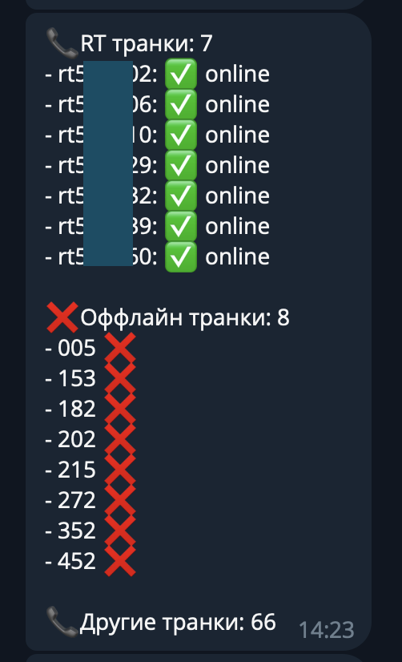

# statusTranksFromPBXToTelegram

This code performs the following actions:

- Creates several empty arrays to store trunk data.
- Iterates over each element (trunk) in the data array.
- Extracts the values of the "resource" and "state" fields from each element.
- Creates an instance of the Trunk structure with the obtained values and adds it to one of three trunk arrays (rtTrunks, onlineTrunks, offlineTrunks) based on conditions.
- Sorts each of the trunk arrays by name.
- Formats a message with information about the number of trunks (rtTrunks) and a status symbol for each trunk.
- Outputs the formatted message.

This code is designed to process trunk data and organize it into different arrays based on specific conditions. It then sorts the arrays and generates a formatted message displaying the number of trunks and their status symbols.

I run this via a cron. The necessary variables need to be added to the environment: 
- BOT_TOKEN, CHAT_ID for Telegram (CHAT_THREAD_ID is filled optionally, if it is necessary to send to a specific group thread.)
- URL, USER, PASS for user from ARI

